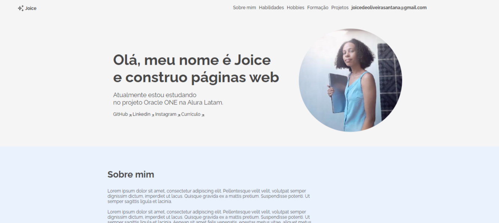

# Challenge ONE | Front End - Portfólio
---

     

# Visite o site: https://joiceoliveiras.github.io/Challenge-portifolio-Alura/

# Sobre

**Portifólio** é um projeto do curso frontend da Alura em que eu crio meu portifólio utilizando HTML, CSS e Javascript.

# Tecnologias utilizadas
- HTML
- CSS
- Javascript

